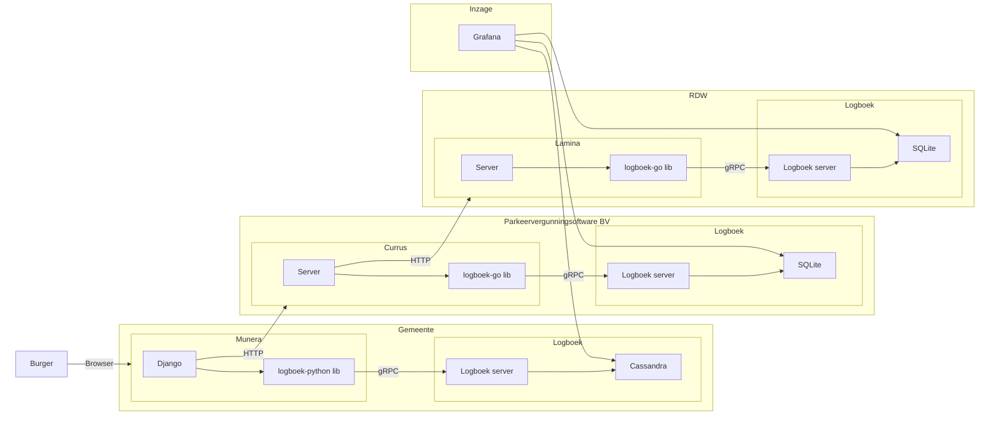

# Logboek dataverwerkingen demo

Een demo hoe de standaard [Logboek dataverwerkingen](https://github.com/MinBZK/logboek-dataverwerkingen) ingezet kan worden.


## Componenten

Deze demo bestaat uit de volgede componenten (te vinden in de `apps` directory):

- **[munera](./apps/munera)**: een fictive Mijn Gemeente-omgeving waar burgers gemeentezaken kunnen regelen;
- **[currus](./apps/currus)**: een API voor het beheren van parkeervergunningen;
- **[lamina](./apps/lamina)**: een API voor het beschiknbaar stellen van registratiegegevens van voertuigen.


## Gebruik

Voor het starten van de demo zijn [Docker](https://docs.docker.com/get-docker/) en [Docker Compose](https://docs.docker.com/compose/install/) nodig.

1. Maak een kopie van deze repository:
    ```sh
    git clone https://github.com/MinBZK/logboek-dataverwerkingen-demo.git

    cd logboek-dataverwerkingen-demo
    ```

1. Start de demo:
    ```sh
    make start
    ```

1. Navigeer naar <http://localhost:8080/>. Aanmelden kan met de gebruikersnaam `burger` en wachtwoord `demo123`.

1. Bekijk de logboeken via <http://localhost:3000>.


## Architectuur




## License

Licensed under EUPL v1.2
